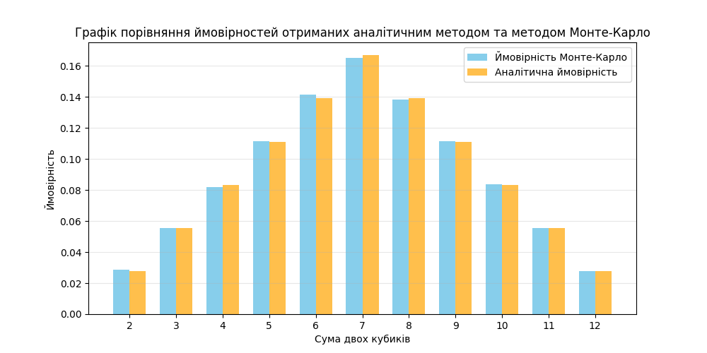

# Фінальний проєкт з курсу "Basic Algorithms and Data Structures" 
Фінальний проєкт курсу, що охоплює всі пройдені теми і складається з 7 завдань. 

## Навігація по завданням

<div>
<ol>
<li><a href="#інструкція-щодо-використання-репозиторію">Інструкція щодо використання репозиторію</a></li>
<li><a href="#завдання-1-структури-даних-сортування-робота-з-однозвязним-списком">Завдання 1: Структури даних. Сортування. Робота з однозв'язним списком</a></li>
<li><a href="#завдання-2-рекурсія-створення-фрактала-дерево-піфагора">Завдання 2: Рекурсія. Створення фрактала "дерево Піфагора"</a></li>
<li><a href="#завдання-3-дерева-алгоритм-дейкстри">Завдання 3: Дерева, алгоритм Дейкстри</a></li>
<li><a href="#завдання-4-візуалізація-піраміди-побудова-функції-для-візуалізації-бінарної-купи">Завдання 4: Візуалізація піраміди. Побудова функції для візуалізації бінарної купи</a></li>
<li><a href="#завдання-5-візуалізація-обходу-бінарного-дерева">Завдання 5: Візуалізація обходу бінарного дерева</a></li>
<li><a href="#завдання-6-жадібні-алгоритми-та-динамічне-програмування">Завдання 6: Жадібні алгоритми та динамічне програмування</a></li>
<li><a href="#завдання-7-використання-методу-монте-карло">Завдання 7: Використання методу Монте-Карло</a></li>
</ol>
</div>

## Інструкція щодо використання репозиторію

1. Склонуйте репозиторій

```bash
git clone [repository-url]
cd goit-algo-fp
```

2. Перейдіть у директорію проєкту та активуйте віртуальне середовище

```bash
 python -m venv .venv
 # On Windows:
 .venv\Scripts\activate
 # On Unix/MacOS:
 source .venv/bin/activate
```

3. Встановіть необхідні залежності

```bash
# Install all dependencies (including development tools)
pip install -r requirements.txt
```

4. Запустіть головний файл main.py у відповідній папці проєкту

```bash
python -m task_1.main
```

## Завдання 1: Структури даних. Сортування. Робота з однозв'язним списком
У цьому завданні реалізовано основні операції над однозв’язним списком:  

- Реверсування списку (reverse_list)  
- Сортування списку алгоритмом злиттям (merge_sort)  
- Злиття двох відсортованих списків у новий відсортований список (merge_sorted_lists)

### Основні моменти реалізації

**Структура даних:**
- Реалізацію класів `Node` та `LinkedList` взято з навчального конспекту

**Реверсування списку (`reverse_list`):**
- Змінює напрямок усіх посилань між вузлами ітеративно
- Виконується без створення нових вузлів, на місці
- Складність: O(n) за часом, O(1) за пам'яттю

**Сортування злиттям (`sort`):**
- Використовує алгоритм merge sort, адаптований для однозв'язних списків
- Застосовує техніку "повільного та швидкого покажчиків" для знаходження середини
- Рекурсивно ділить список і зливає відсортовані частини
- Складність: O(n log n) за часом, O(log n) за пам'яттю (стек рекурсії)

**Злиття відсортованих списків (`get_merge_sorted_lists`):**
- Приймає два відсортовані LinkedList об'єкти
- Створює новий LinkedList з об'єднаними та відсортованими елементами
- Використовує допоміжну функцію `merge_sorted_lists` з модуля алгоритмів
- Складність: O(n + m), де n і m - розміри списків

**Технічні деталі:**
- Всі операції виконуються на рівні вузлів для оптимальної ефективності
- Включає допоміжні функції (`create_linked_list_from_array`) для зручності роботи
- Демонстраційна програма показує всі реалізовані можливості
- Інтегровано з системою обробки помилок через декоратори

## Завдання 2: Рекурсія. Створення фрактала "дерево Піфагора"
У цьому завданні реалізовано програму для створення фрактала "дерево Піфагора" з використанням рекурсії та візуалізації за допомогою бібліотеки turtle.

### Основні моменти реалізації

**Структура даних:**
- Використовується модуль turtle для графічної візуалізації
- Система обробки помилок через власні винятки та декоратори

**Парсинг рівня рекурсії (`parse_rec_depth`):**
- Валідує введений користувачем рівень рекурсії
- Викидає `DepthValueIsNotValidException` у разі некоректного вводу

**Рекурсивне малювання гілки (`draw_pythagoras_branch`):**
- Рекурсивно малює одну гілку дерева Піфагора
- Складність: O(2^n) за часом, O(n) за пам'яттю (стек рекурсії)

**Головна функція малювання (`draw_pythagoras_tree`):**
- Налаштовує початкові параметри черепашки (швидкість, позицію)
- Встановлює початкову орієнтацію (90° вгору)
- Викликає рекурсивну функцію з початковою довжиною 200 пікселів

**Технічні деталі:**
- Використовує бібліотеку turtle для 2D графіки
- Кожна гілка розгалужується на дві підгілки під кутами ±45°
- Коефіцієнт зменшення довжини гілок: 0.7
- Інтегровано з системою обробки помилок через декоратори

## Завдання 3: Дерева, алгоритм Дейкстри
У цьому завданні реалізовано алгоритм Дейкстри для знаходження найкоротших шляхів у зваженому графі з використанням бінарної купи. Завдання включає створення графа, використання піраміди для оптимізації вибору вершин та обчислення найкоротших шляхів від початкової вершини до всіх інших.

### Основні моменти реалізації

**Структура даних:**
- Використовується бібліотека NetworkX для роботи з графами
- Візуалізація графу за допомогою matplotlib
- Граф представляє населені пункти Обухівської громади Київської області

**Створення графу (`initialize_graph`):**
- Створює неорієнтований граф з 21 населеним пунктом
- Вершини мають атрибути: вага (розмір для візуалізації) і колір
- Ребра представляють відстані між населеними пунктами в кілометрах
- Координати вершин відповідають реальним географічним координатам

**Візуалізація графу (`handle_graph_build`):**
- Використовує реальні географічні координати для позиціонування вершин
- Розмір вузлів залежить від їх ваги (обернено пропорційно)
- Кольорове кодування: червоний (центр), синій (великі міста), зелений (села)

**Алгоритм Дейкстри (`dijkstra_heap_algorithm`):**
- Реалізований з використанням бінарної купи (heapq)
- Повертає найкоротші відстані та повні маршрути до всіх вершин
- Складність: O((V + E) log V), де V - кількість вершин, E - кількість ребер
- Оптимізований для роботи з великими графами

**Обробка результатів (`handle_dijkstra`):**
- Запускає алгоритм Дейкстри від заданої початкової вершини (за замовчуванням "Обухів")
- Виводить найкоротші маршрути у читаному форматі
- Показує послідовність населених пунктів та загальну протяжність маршруту

**Технічні деталі:**
- Граф містить 21 вершину та 23 ребра
- Бінарна купа забезпечує ефективний вибір наступної вершини з мінімальною відстанню
- Зберігається повна інформація про маршрут (не лише відстань)
- Інтегровано з системою обробки помилок через декоратори
- Підтримка відображення українських назв населених пунктів

## Завдання 4: Візуалізація піраміди. Побудова функції для візуалізації бінарної купи
У цьому завданні реалізовано програму для візуалізації бінарної купи (піраміди) шляхом перетворення її у бінарне дерево та графічного відображення за допомогою matplotlib і NetworkX.

### Основні моменти реалізації

**Структура даних:**
- Використовується клас `Node` з унікальними ідентифікаторами для кожного вузла
- Візуалізація дерева виконана за допомогою базової функції `draw_tree` з задачі, що використовує бібліотеки NetworkX для створення графу та matplotlib для візуалізації

**Створення купи (`build_heap`):**
- Підтримує два режими: базова купа з заздалегідь визначеними значеннями та випадкова купа
- Використовує модуль heapq для створення мін-купи з випадкових значень

**Перетворення купи у бінарне дерево (`get_binary_tree`):**
- Рекурсивно будує бінарне дерево з масиву купи
- Використовує стандартну формулу індексації купи: для батька на позиції i, ліва дитина на позиції 2*i+1, права дитина на позиції 2*i+2
- Складність: O(n) за часом та пам'яттю

**Технічні деталі:**
- Підтримка як базових, так і випадково згенерованих куп
- Інтегровано з системою обробки помилок через декоратори
- Візуалізація блокує виконання програми до закриття вікна графіку

## Завдання 5: Візуалізація обходу бінарного дерева
У цьому завданні реалізовано програму для візуалізації алгоритмів обходу бінарного дерева: у глибину (DFS) та в ширину (BFS). Програма використовує код з завдання 4 для побудови бінарного дерева та додає кольорове кодування для відображення порядку відвідування вузлів.

### Основні моменти реалізації

**Структура даних:**
- Використовується існуюча Node клас з завдання 4 для представлення вузлів дерева
- Застосовується черга (Queue) для BFS та стек (list) для DFS алгоритмів

**Алгоритм пошуку в ширину (`bfs_algorithm`):**
- Використовує чергу FIFO (First In, First Out) з модуля queue
- Обходить дерево по рівнях: спочатку корінь, потім всі його діти, потім діти дітей
- Складність: O(n) за часом, O(w) за пам'яттю, де w - максимальна ширина дерева

**Алгоритм пошуку в глибину (`dfs_algorithm`):**
- Використовує стек LIFO (Last In, First Out) на основі списку Python
- Обходить дерево вглиб: корінь, ліва підгілка повністю, права підгілка
- Додає дітей у стек у зворотному порядку (спочатку праву, потім ліву) для правильного обходу
- Складність: O(n) за часом, O(h) за пам'яттю, де h - висота дерева

**Кольорове кодування (`color_nodes`):**
- Реалізує градієнтне забарвлення від синього (#0000FF) до жовтого (#FFFF00)
- Використовує лінійну інтерполяцію в RGB просторі для плавного переходу кольорів
- Кожен вузол отримує унікальний колір залежно від його позиції у послідовності обходу

**Допоміжні функції кольорів:**
- `hex_to_rgb`: перетворює HEX формат у RGB кортеж
- `rgb_to_hex`: перетворює RGB кортеж у HEX формат  
- `interpolate_color`: обчислює проміжний колір між початковим та кінцевим кольорами

**Технічні деталі:**
- Використовує базову купу з завдання 4 для демонстрації обох алгоритмів
- Кольорова візуалізація показує різницю між алгоритмами обходу
- DFS показує вертикальний обхід (вглиб по гілках)
- BFS показує горизонтальний обхід (по рівнях)
- Інтегровано з системою обробки помилок через декоратори
- Плавний градієнт від темних (ранні вузли) до світлих відтінків (пізні вузли)

## Завдання 6: Жадібні алгоритми та динамічне програмування
У цьому завданні реалізовано програму для розв'язання задачі вибору їжі з максимальною сумарною калорійністю в межах обмеженого бюджету, використовуючи два підходи: жадібний алгоритм та динамічне програмування.

### Основні моменти реалізації

**Структура даних:**
- Використовується словник `food_items` з інформацією про страви (назва, вартість, калорійність)
- Доступні страви: pizza (50/300), hamburger (40/250), hot-dog (30/200), pepsi (10/100), cola (15/220), potato (25/350)
- Формат: {"назва": {"cost": вартість, "calories": калорійність}}

**Жадібний алгоритм (`greedy_algorithm`):**
- Обчислює співвідношення калорій до вартості для кожної страви
- Сортує страви за спаданням ефективності (калорії/грн)
- Вибирає страви у порядку найкращого співвідношення, доки не вичерпається бюджет
- Складність: O(n log n) через сортування, де n - кількість страв

**Динамічне програмування (`dynamic_programming`):**
- Створює таблицю оптимальних рішень для всіх можливих бюджетів від 0 до заданого
- Для кожного бюджету знаходить максимальну кількість калорій та оптимальний вибір страв
- Відстежує вибрані продукти для реконструкції оптимального меню
- Складність: O(budget × n), де budget - розмір бюджету, n - кількість страв

**Вимірювання продуктивності (`execute_and_measure_time`):**
- Використовує модуль `timeit` для точного вимірювання часу виконання
- Обчислює загальну калорійність, вартість та решту для кожного алгоритму
- Форматує результати у зрозумілому вигляді з деталізацією меню

**Допоміжні функції:**
- `calculate_menu_stats`: обчислює загальну калорійність та вартість обраного меню
- `get_menu_results`: форматує результати виконання алгоритму у текстовому вигляді

### Порівняльний аналіз алгоритмів

**Результати тестування на різних бюджетах:**

| Бюджет | Алгоритм | Калорії | Вартість | Решта | Час виконання |
|--------|----------|---------|----------|-------|---------------|
| 126 грн | Жадібний | 1760 ккал | 120 грн | 6 грн | ~8.3×10⁻⁶ сек |
| 126 грн | Динамічний | 1800 ккал | 125 грн | 1 грн | ~7.1×10⁻⁵ сек |
| 1055 грн | Жадібний | 15400 ккал | 1050 грн | 5 грн | ~5.7×10⁻⁶ сек |
| 1055 грн | Динамічний | 15440 ккал | 1055 грн | 0 грн | ~6.3×10⁻⁴ сек |
| 15294 грн | Жадібний | 224180 ккал | 15285 грн | 9 грн | ~4.1×10⁻⁵ сек |
| 15294 грн | Динамічний | 224220 ккал | 15290 грн | 4 грн | ~9.9×10⁻³ сек |

**Висновки з аналізу:**
- **Оптимальність**: Динамічне програмування завжди дає оптимальний результат з вищою калорійністю
- **Швидкість**: Жадібний алгоритм значно швидший, особливо на великих бюджетах
- **Масштабованість**: Різниця у швидкості зростає експоненційно зі збільшенням бюджету
- **Практичність**: Жадібний алгоритм дає прийнятні результати з мінімальними затратами часу

**Технічні деталі:**
- Використовує ефективний підрахунок співвідношення калорій/вартість для жадібного підходу
- Динамічне програмування будує повну таблицю станів для гарантованого оптимуму
- Інтегровано з системою обробки помилок через декоратори
- Модульна архітектура з розділенням алгоритмів, констант та допоміжних функцій
- Порівняння виконується на трьох різних бюджетах для демонстрації масштабованості

## Завдання 7: Використання методу Монте-Карло
У цьому завданні реалізовано програму для обчислення ймовірностей сум при киданні двох кубиків за допомогою методу Монте-Карло. Програма імітує велику кількість кидків, підраховує частоту кожної суми та порівнює результати з аналітичними розрахунками.

### Основні моменти реалізації

**Структура даних:**
- Використовується словник `analytic_probabilities` з теоретичними ймовірностями для кожної суми (2-12)
- Результати симуляції зберігаються у аналогічному словнику для порівняння

**Алгоритм Монте-Карло (`monte_carlo_simulation`):**
- Генерує задану кількість випадкових кидків двох кубиків (за замовчуванням 100,000)
- Використовує `random.randint(1, 6)` для імітації шестигранного кубика
- Підраховує частоту кожної можливої суми від 2 до 12
- Обчислює ймовірності як відношення кількості появ до загальної кількості кидків

**Порівняльна таблиця (`show_probability_comparison_table`):**
- Форматує результати у вигляді структурованої таблиці
- Відображає аналітичні та експериментальні ймовірності поруч для легкого порівняння
- Використовує процентний формат для наочності результатів

**Графічна візуалізація (`show_probability_comparison_graph`):**
- Створює порівняльну гістограму за допомогою matplotlib
- Відображає два набори стовпчиків: теоретичні (помаранчеві) та експериментальні (блакитні) ймовірності
- Включає легенду, підписи осей та сітку для кращого сприйняття

### Порівняльний аналіз результатів

**Результати симуляції (100,000 кидків):**

| Сума | Аналітична ймовірність | Ймовірність Монте-Карло | Абсолютна похибка |
|------|------------------------|-------------------------|-------------------|
| 2    | 2.78%                  | 2.81%                   | 0.03%             |
| 3    | 5.56%                  | 5.55%                   | 0.01%             |
| 4    | 8.33%                  | 8.16%                   | 0.17%             |
| 5    | 11.11%                 | 11.14%                  | 0.03%             |
| 6    | 13.89%                 | 13.88%                  | 0.01%             |
| 7    | 16.67%                 | 16.62%                  | 0.05%             |
| 8    | 13.89%                 | 13.98%                  | 0.09%             |
| 9    | 11.11%                 | 11.21%                  | 0.10%             |
| 10   | 8.33%                  | 8.36%                   | 0.03%             |
| 11   | 5.56%                  | 5.50%                   | 0.06%             |
| 12   | 2.78%                  | 2.80%                   | 0.02%             |




**Висновки щодо правильності розрахунків:**

- **Високa точність**: Максимальна абсолютна похибка становить лише 0.17%, що підтверджує правильність реалізації методу Монте-Карло
- **Збіжність до теоретичних значень**: Всі експериментальні ймовірності знаходяться в межах статистичної похибки від аналітичних розрахунків
- **Найвища точність для центральних сум**: Суми 6, 7, 8 (найбільш ймовірні) мають найменшу відносну похибку, що відповідає законам статистики
- **Ефективність великої вибірки**: 100,000 ітерацій забезпечують достатню точність для практичних застосувань

**Теоретичне обґрунтування:**
- Сума 7 має найвищу ймовірність (16.67%), оскільки може бути отримана 6 способами: (1,6), (2,5), (3,4), (4,3), (5,2), (6,1)
- Суми 2 та 12 мають найнижчу ймовірність (2.78%), оскільки кожна може бути отримана лише одним способом: (1,1) та (6,6) відповідно
- Розподіл ймовірностей є симетричним відносно суми 7, що підтверджується як аналітично, так і експериментально

**Технічні деталі:**
- Використовує модуль `random` для генерації псевдовипадкових чисел
- Модульна архітектура з розділенням симуляції, констант та обробки результатів
- Візуалізація виконана за допомогою matplotlib з інтерактивними графіками
- Інтегровано з системою обробки помилок через декоратори
- Підтримка різної кількості ітерацій для дослідження збіжності методу
